# PharmaSite Intelligence: Metodologia e Scoring Engine

Documento de Referência Técnico-Metodológica

***

Este documento detalha o funcionamento do **Motor de Scoring do PharmaSite**, abordando as fontes de dados, o gerenciador de cenários e as fórmulas testadas estatisticamente aplicadas para compor o rankeamento definitivo dos municípios do estado de São Paulo para a operação B2B.

## 1. Tratamento e Normalização Estrutural de Dados

O abismo populacional no Estado de São Paulo (onde a capital possui 11,4 milhões de habitantes contra Uru com aprox. 1.000) cria distorções catastróficas em cálculos lineares.

Para garantir que o motor seja sensível aos municípios de médio porte do interior, todas as variáveis absolutas são tratadas usando o seguinte framework matemático:

1. **Preenchimento de Zeros Seguros (Imputação de Fallback):** Em divisões sensíveis, populações nulas (0) são convertidas para `NaN` para evitar colapsos matemáticos.
2. **Transformação Logarítmica (`Z-Flattening`):** Aplicamos `log1p(X)` nas massas absolutas. A fórmula $Y = ln(X + 1)$ reduz a curvatura hiperbólica.
3. **Escalonamento Min-Max (0 a 1):** Os dados são normalizados num range fixo para análise.

### 1.1 Calibração Estatística Baseada em Vendas (BRB)

Pesos que anteriormente eram calibrados por validação heurística (pilares estáticos) agora são submetidos a uma função de regressão de Mínimos Quadrados Não Negativos (NNLS) ou Regressão Ridge usando os dados absolutos de **Total de Venda (Receita Bruta)** por município, extraídos dos relatórios reais de faturamento da matriz BRB.
A regressão entende as variáveis demográficas, econômicas e logísticas (X) e descobre estaticamente as correlações com as Vendas Absolutas (y).
Ao final do treinamento da camada offline, o motor grava e gerencia "Estados de Calibração" (What-If Scenarios) para que possamos testar pesos engessados contra os calibrados no laboratório.

---

## 2. Fontes Secundárias (Data Sources)

| Fonte | API/Módulo | Descrição Técnica & Coletas |
| :--- | :--- | :--- |
| **IBGE Agregados** | `servicodados/v3/agregados` | População total, faixas etárias atômicas (0-4, 5-14, 30-44, 45-64, 65+), Urbana e Rural, e Renda per Capita. |
| **DataSUS (CNES)** | `estabelecimentos` | Quantidade bruta de Farmácias, Consultórios Médicos, Consultórios Odontológicos, Clínicas e Laboratórios por código local.* |
| **IPEADATA** | `odata4/Metadados` | PIB per Capita total e Índice de Desenvolvimento Humano Municipal (IDH). |
| **Ans gov.br** | `beneficiarios_municipio` | Volumetria de usuários atrelados a planos de saúde privados (cobertura e poder de compra de health-care). |

*\* **Hack CNES Paginated Fallback**: Como instabilidades nos servidores de API do Governo são recorrentes, o extrator realiza um fallback robusto para paginações agressivas em lotes via offset caso o endpoint consolidado negue os pacotes REST (Prevenção contra Timeouts da Datasus).*

---

## 3. Fórmulas e Hacks de Conversão Demográfica

O motor utiliza heurísticas de derivação para converter dados atômicos brutos para inteligência competitiva comercial (KPIs).

### 3.1. Índices e Proporções re

* **Percentual População Alvo (Hacking Econômico Ativo):**
    $$Pop_{Alvo} = Pop_{(30\ a\ 44)} + Pop_{(45\ a\ 64)}$$
    *O racional por trás desse hack:* O consumo corriqueiro de medicamentos, correlatos e cosméticos possui a curva mais acentuada de *ticket-médio* na faixa trintária até a porta da terceira idade.
* **Percentual de Envelhecimento Clínico:**
    $$Elderly\% = \left( \frac{Pop_{(65+)}}{Pop_{Total}} \right) \times 100$$
* **Índice de Envelhecimento Bruto (O.M.S.):**
    Estima a proporção de idosos para as gerações de reposição jovem.
    $$Indice = \left( \frac{Pop_{(65+)}}{Pop_{(0\ a\ 4)} + Pop_{(5\ a\ 14)}} \right) \times 100$$

### 3.2. Restrição Logística Rigorosa (Raio de Gravidade)

A prioridade comercial é o acesso aos insumos pelo eixo dinâmico Campinas-SP.

* **Cálculo da Distância da Sede:** Fórmula esférica de `Haversine` usando o centróide das malhas municipais contra a L/L de Campinas $(-22.9056, -47.0608)$.
* **Decaimento Lógico (Score Logístico O-100):** O score logístico morre e converge para rigoroso 0 à medida que atinge os 300km intransponíveis (*Target Radius Limit*).
    $$Score_{Logistico} = Max \left(0,\ 1 - \frac{Dist_{Km}}{300_{Km}}\right) \times 100$$

### 3.3. Densidade de Competição Dinâmica

Ao invés de tratar grande competitividade como "Risco de Saturação" , tratamos ela de forma proxyétrica para o setor logístico e de distribuição: Onde existem muitas farmácias competindo `(farmacias_por_10k)`, significa demanda brutal ou fragmentação agressiva de PDVs que obriga a pulverização de compras.

* **Hack via Ranqueamento por Percentil:** O atributo da competência é jogado de modo flutuante na curva normal sem escalas de peso:
    $Score = PercentileRank(farmacias/10k) \times 100$

---

## 4. O Composto do Score (The Master Engine Matrix)

O índice composto que unifica o Score Total do PharmaBase obedece a distribuição hierárquica baseada nos pesos brutos: **Demografia (100)**, **Logística (100)**, **Economia (90)**, **Saúde (80)** e **Competitividade (80)**.

### Diagrama Funcional dos Pesos Intrapilares

```mermaid
graph TD
    classDef main fill:#1E293B,color:#FFF,stroke:#FFF,font-weight:bold;
    classDef sub fill:#3B82F6,color:#FFF,stroke:none;
    classDef demo fill:#F59E0B,color:#FFF,stroke:none;
    classDef ecom fill:#10B981,color:#FFF,stroke:none;
    
    T[Score Total Multi-Pilar\nValor Final]:::main

    D[Demografia 22.2%] --> T:::demo
       D_P1[Pop Total 40%] --> D
       D_P2[Pop Alvo 35%] --> D
       D_P3[Urbana 15%] --> D
       D_P4[ID-Idosos 10%] --> D

    L[Logística 22.2%] --> T:::sub
       L_P1[Dist. Linear 45%] --> L
       L_P2[Farmácias Qtd 40%] --> L
       L_P3[Farm/10k pop 15%] --> L

    E[Economia 20.0%] --> T:::ecom
       E_P1[Renda p/Capita 40%] --> E
       E_P2[PIB p/Capita 25%] --> E
       E_P3[IDH Municipal 20%] --> E
       E_P4[Cov. Planos 15%] --> E

    S[Saúde & Infra 17.8%] --> T:::sub
       S_P1[Farmac. Abs. 55%] --> S
       S_P2[Odonto 20%] --> S
       S_P3[Labs 15%] --> S
       S_P4[Clínicas 10%] --> S
       
    C[Competitividade 17.8%] --> T:::demo
       C_P1[Percentil Market Density] --> C
```

*(Cada uma das equações atômicas de folha (ex: `Renda p/Capita 40%`) foi primeiramente achatada via Logn, submetida ao processo iterativo estrito do MinMaxScaler de `0->1` e então multiplicada por sua porcentagem de pilar, garantindo ausência perimetral nula e representatividade justa na cadeia analítica final).*
